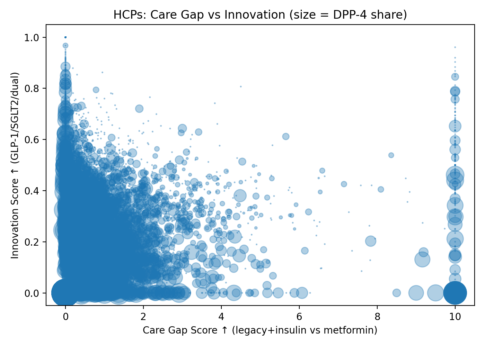
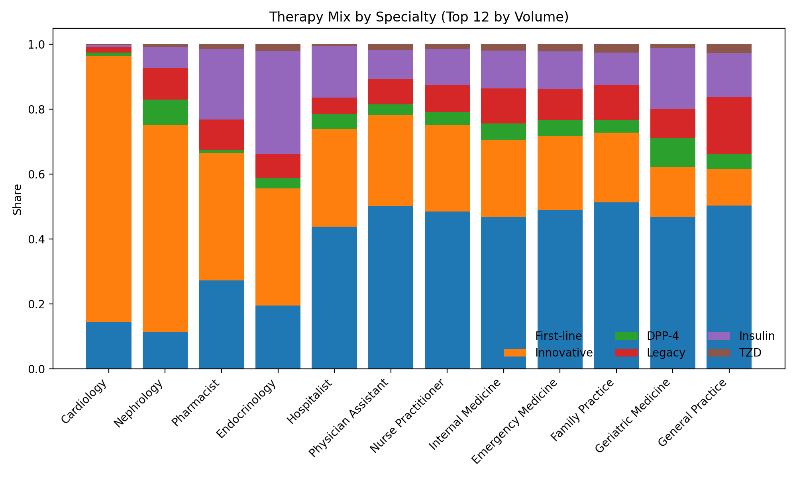
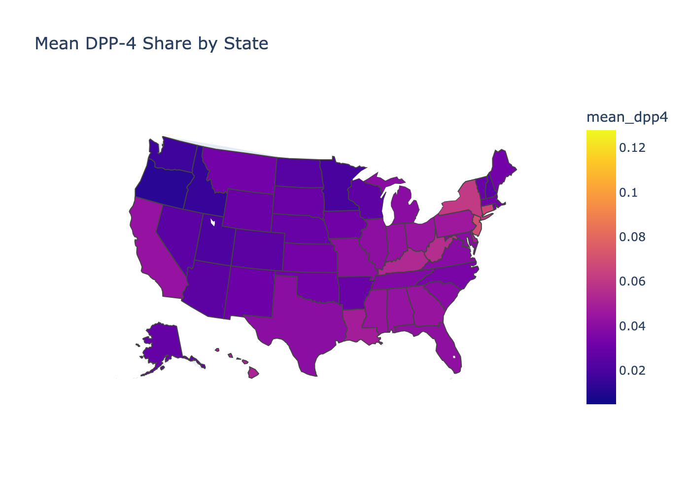

# Care Gap & HCP Segmentation – Case Study

## Overview
This project uses the **CMS Part D Prescriber PUF (2023)** to analyze diabetes-related prescribing patterns.  
We identify **care gaps**, **innovation adoption (GLP-1/SGLT2)**, and **DPP-4 heavy reliance**, then segment HCPs into personas.

## Pipeline
1. **Data Prep**: Map drugs to categories, handle combos, apportion Rx counts.
2. **Feature Engineering**: % shares, Care Gap Score, Innovation Score.
3. **Segmentation**: High Gap, Innovator, DPP-4 Heavy, Guideline-Aligned, Other.
4. **Visualization**: Scatter plots, stacked shares, choropleths.

## Results
- Family Practice drives volume but shows moderate innovation adoption.
- Endocrinology & Nephrology lead in GLP-1/SGLT2 uptake.
- ~7k prescribers are **DPP-4 Heavy**.
- High-gap prescribers cluster in primary care.

## Visuals
  
  

🔗 Interactive map: https://BrooksErica.github.io/hcp-care-gap/state_dpp4.html  
🖼️ Static PNG (in the PDF): 

## Repo Structure
